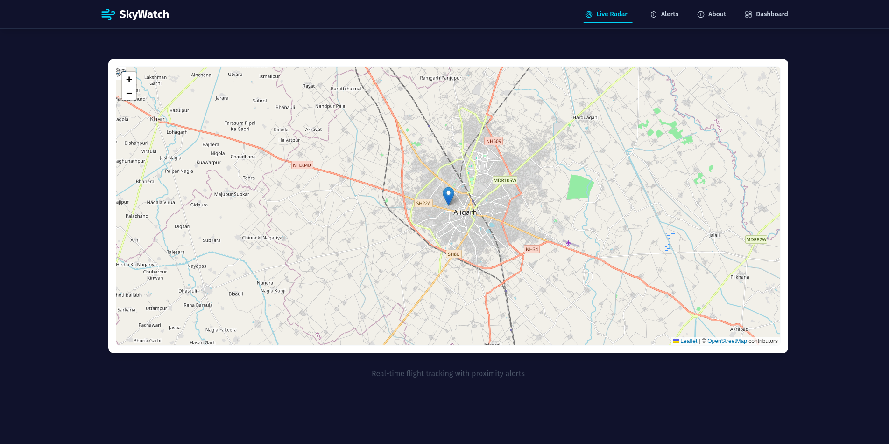
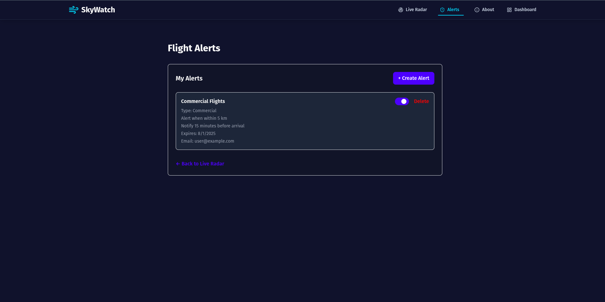

# ✈️ SkyWatch Alerts

**SkyWatch Alerts** revolutionizes airspace awareness by offering real-time flight tracking and intelligent proximity alerts. Whether you're an aviation enthusiast, professional, or just curious about local air traffic, our platform keeps you informed with accurate and timely information.

## 🚀 Features

### 📡 Live Flight Tracking
Track aircraft in real-time, displaying key details such as:
- Altitude
- Speed
- Heading
- Aircraft model and flight number

### 🔔 Smart Proximity Alerts
Get notified when an aircraft enters a user-defined radius:
- Set your own geolocation or enter coordinates manually
- Customize lead times before aircraft arrival
- Receive alerts directly via email

### 📈 Flight History (Flight Archaeology)
Analyze past flight patterns:
- Browse historical flight paths
- Understand aircraft behavior over time
- Useful for research, safety checks, and enthusiasts

## 🛠️ How It Works

1. **Set Your Location**
   - Allow browser geolocation access **OR**
   - Enter custom coordinates (latitude & longitude)

2. **Configure Alerts**
   - Choose your alert radius (e.g. 10 km around your location)
   - Filter by aircraft type or altitude range (optional)
   - Set your preferred lead time for notifications

3. **Receive Notifications**
   - When a matching flight enters your defined area, you'll receive an email alert in real-time

## 📦 Tech Stack

- **Frontend**: React / Tailwind CSS / Leaflet.js (Map Rendering)
- **Backend**: Node.js / Express.js
- **Database**: MongoDB (Flight logs, user settings)
- **Flight Data Source**: [OpenSky Network](https://opensky-network.org/) or similar real-time aviation data API
- **Email Notifications**: NodeMailer / SendGrid
- **Geolocation**: HTML5 Geolocation API / Manual entry

## Installation
Checkout [LEARN.md](LEARN.md)

## 🧪 Use Cases

- **Spotting local aircraft activity**
- **Drone pilot airspace awareness**
- **Aviation research or education**
- **General curiosity about flights above you**

## 📸 Screenshots

### 🏠 Home Page

---

### ℹ️ About Page

---

### 🚨 Alert Page

## Upcoming Updates
Looking to contribute? Here are a few beginner-friendly areas where you can help improve the project:

- Integrating a persistent **database** (e.g. MongoDB for storing user preferences and alerts)
- Adding **real-time alert systems** (email, WhatsApp, or push notifications)
- Enhancing **map features** (e.g. better markers, aircraft paths, clustering)
- Adding unit and integration **tests**
- Improving the **UI/UX design** and responsiveness

## Contributing

Pull requests are welcome! If you’re unsure where to start, check out the **Upcoming Updates** section above or open an issue.

If you find this project helpful, please consider giving it a ⭐ **star** to support its development and visibility!

## ⚠️ Disclaimer

SkyWatch Alerts is for **informational purposes only**. It should not be relied upon for critical aviation decisions or safety-sensitive operations.

## 📄 License

The project is licensed under the [MIT License](LICENSE)

---

